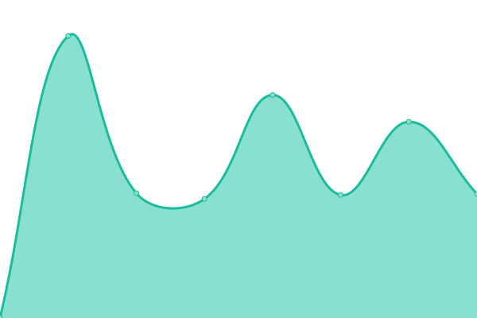

# [📈 Live Status](https://robingenz.github.io/upptime): <!--live status--> **🟧 Partial outage**

This repository contains the open-source uptime monitor and status page for [Robin Genz](https://robingenz.dev), powered by [Upptime](https://github.com/upptime/upptime).

With [Upptime](https://upptime.js.org), you can get your own unlimited and free uptime monitor and status page, powered entirely by a GitHub repository. We use [Issues](https://github.com/robingenz/upptime/issues) as incident reports, [Actions](https://github.com/robingenz/upptime/actions) as uptime monitors, and [Pages](https://robingenz.github.io/upptime) for the status page.

<!--start: status pages-->
<!-- This summary is generated by Upptime (https://github.com/upptime/upptime) -->
<!-- Do not edit this manually, your changes will be overwritten -->
<!-- prettier-ignore -->
| URL | Status | History | Response Time | Uptime |
| --- | ------ | ------- | ------------- | ------ |
|  [robingenz.dev](https://robingenz.dev/) | 🟩 Up | [robingenz-dev.yml](https://github.com/robingenz/upptime/commits/HEAD/history/robingenz-dev.yml) | 

 1722ms
     
 | 

<a href="https://robingenz.github.io/upptime/history/robingenz-dev">100.00%</a>
    

|  NC | 🟩 Up | [nc.yml](https://github.com/robingenz/upptime/commits/HEAD/history/nc.yml) | 

 1221ms
     
 | 

<a href="https://robingenz.github.io/upptime/history/nc">100.00%</a>
    

|  TS3 Server | 🟩 Up | [ts-3-server.yml](https://github.com/robingenz/upptime/commits/HEAD/history/ts-3-server.yml) | 

 1377ms
     
 | 

<a href="https://robingenz.github.io/upptime/history/ts-3-server">100.00%</a>
    

|  IA | 🟩 Up | [ia.yml](https://github.com/robingenz/upptime/commits/HEAD/history/ia.yml) | 

 719ms
     
 | 

<a href="https://robingenz.github.io/upptime/history/ia">100.00%</a>
    

|  HN | 🟩 Up | [hn.yml](https://github.com/robingenz/upptime/commits/HEAD/history/hn.yml) | 

 2025ms
     
 | 

<a href="https://robingenz.github.io/upptime/history/hn">100.00%</a>
    

|  Blog | 🟩 Up | [blog.yml](https://github.com/robingenz/upptime/commits/HEAD/history/blog.yml) | 

 1258ms
     
 | 

<a href="https://robingenz.github.io/upptime/history/blog">100.00%</a>
    

|  DHBW VS Internal API | 🟩 Up | [dhbw-vs-internal-api.yml](https://github.com/robingenz/upptime/commits/HEAD/history/dhbw-vs-internal-api.yml) | 

 1082ms
     
 | 

<a href="https://robingenz.github.io/upptime/history/dhbw-vs-internal-api">100.00%</a>
    

|  DHBW VS External API | 🟥 Down | [dhbw-vs-external-api.yml](https://github.com/robingenz/upptime/commits/HEAD/history/dhbw-vs-external-api.yml) | 

 952ms
     
 | 

<a href="https://robingenz.github.io/upptime/history/dhbw-vs-external-api">90.98%</a>
    

|  KickerTracker App | 🟩 Up | [kicker-tracker-app.yml](https://github.com/robingenz/upptime/commits/HEAD/history/kicker-tracker-app.yml) | 

 1288ms
     
 | 

<a href="https://robingenz.github.io/upptime/history/kicker-tracker-app">100.00%</a>
    

|  KickerTracker API | 🟩 Up | [kicker-tracker-api.yml](https://github.com/robingenz/upptime/commits/HEAD/history/kicker-tracker-api.yml) | 

 464ms
     
 | 

<a href="https://robingenz.github.io/upptime/history/kicker-tracker-api">89.82%</a>
    

<!--end: status pages-->

[**Visit our status website →**](https://robingenz.github.io/upptime)

## 📄 License

- Powered by: [Upptime](https://github.com/upptime/upptime)
- Code: [MIT](./LICENSE) © [Robin Genz](https://robingenz.dev)
- Data in the `./history` directory: [Open Database License](https://opendatacommons.org/licenses/odbl/1-0/)
